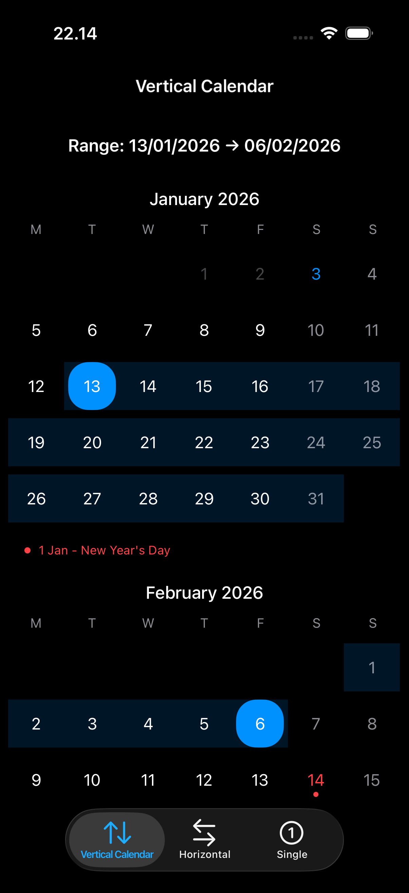
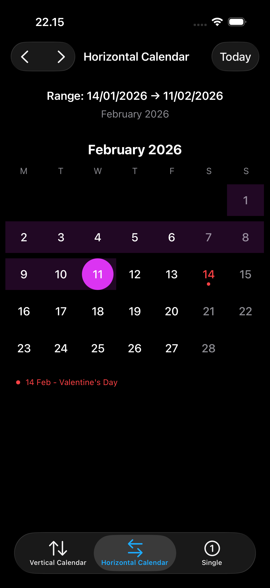
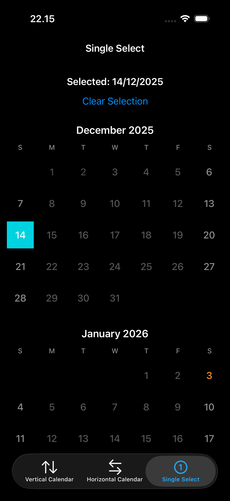

# Karenda (カレンダー)

**English** | [日本語](ja_README.md) | [한국어](ko_README.md)

A modern UIKit-based calendar date picker framework for iOS.


## Features

- 📆 **Calendar Date Picker** - Beautiful vertical or horizontal scrolling calendar
- 📅 **Date Range Selection** - Select single dates or date ranges
- 🎨 **Fully Customizable** - Colors, fonts, and appearance
- 🏖️ **Holiday Support** - Highlight public holidays with dot indicators and names
- 📱 **iOS 13+** - Built with modern UICollectionViewCompositionalLayout
- 🧩 **Easy Integration** - Simple configuration API

<details>
<summary>📸 Screenshots</summary>

| Vertical | Horizontal | Single Select |
|:--------:|:----------:|:-------------:|
|  |  |  |

</details>

## Requirements

- iOS 13.0+
- Swift 5.0+
- Xcode 14.0+

## Installation

### Swift Package Manager

Add Karenda to your project using Swift Package Manager:

```swift
dependencies: [
    .package(url: "https://github.com/yefga/Karenda.git", from: "1.0.0")
]
```

### CocoaPods

Add Karenda to your `Podfile`:

```ruby
pod 'Karenda', '~> 1.0'
```

### Tuist

Add as a project dependency:

```swift
.project(target: "Karenda", path: "../Karenda")
```

## Usage

### Basic Usage

```swift
import Karenda

class MyViewController: UIViewController, KarendaDelegate {
    
    override func viewDidLoad() {
        super.viewDidLoad()
        
        // Define holidays with names
        let holidays: [KarendaHoliday] = [
            KarendaHoliday(date: "01/01/2024", name: "New Year's Day"),
            KarendaHoliday(date: "25/12/2024", name: "Christmas Day")
        ]
        
        // Create configuration
        let config = KarendaConfig(
            startDate: "01/01/2024",
            endDate: "31/12/2024",
            holidays: holidays,
            isMultiSelectEnabled: true,
            direction: .vertical
        )
        
        // Create calendar view
        let calendarPicker = KarendaView(config: config)
        calendarPicker.delegate = self
        view.addSubview(calendarPicker)
        
        // Add constraints
        calendarPicker.translatesAutoresizingMaskIntoConstraints = false
        NSLayoutConstraint.activate([
            calendarPicker.topAnchor.constraint(equalTo: view.safeAreaLayoutGuide.topAnchor),
            calendarPicker.leadingAnchor.constraint(equalTo: view.leadingAnchor),
            calendarPicker.trailingAnchor.constraint(equalTo: view.trailingAnchor),
            calendarPicker.bottomAnchor.constraint(equalTo: view.bottomAnchor)
        ])
    }
    
    // MARK: - KarendaDelegate
    
    func didSelectCalendar(startDate: String, endDate: String) {
        print("Selected range: \(startDate) to \(endDate)")
```

### SwiftUI Usage

Use `KarendaRepresentable` to embed the calendar in SwiftUI views:

```swift
import SwiftUI
import Karenda

struct ContentView: View {
    @State private var selectedStartDate: String?
    @State private var selectedEndDate: String?
    
    var body: some View {
        VStack {
            Text("Selected: \(selectedStartDate ?? "None") to \(selectedEndDate ?? "None")")
                .padding()
            
            KarendaRepresentable(
                config: KarendaConfig(
                    startDate: "01/01/2024",
                    endDate: "31/12/2024",
                    holidays: [
                        KarendaHoliday(date: "25/12/2024", name: "Christmas")
                    ],
                    direction: .vertical
                ),
                selectedStartDate: $selectedStartDate,
                selectedEndDate: $selectedEndDate
            )
            .onDateTapped { date in
                print("Tapped: \(date)")
            }
            .onMonthChanged { month, year in
                print("Viewing: \(month)/\(year)")
            }
        }
    }
}
```

**Single Date Selection (SwiftUI)**:

```swift
KarendaRepresentable(
    startDate: "01/01/2024",
    endDate: "31/12/2024",
    selectedDate: $selectedDate  // Single binding for single select mode
)
```

```swift
let holiday = KarendaHoliday(
    date: "25/12/2024",    // Format: dd/MM/yyyy
    name: "Christmas Day"   // Holiday name shown in footer
)
```

### Scroll Directions

**Vertical Scrolling** (default) - All months stacked vertically:

```swift
let config = KarendaConfig(
    startDate: "01/01/2024",
    endDate: "31/12/2024",
    direction: .vertical
)
```

**Horizontal Scrolling** - One month per page, swipe to navigate:

```swift
let config = KarendaConfig(
    startDate: "01/01/2024",
    endDate: "31/12/2024",
    direction: .horizontal
)
```

### Selection Modes

**Multi-Select (Date Range)**:

```swift
let config = KarendaConfig(
    startDate: "01/01/2024",
    endDate: "31/12/2024",
    isMultiSelectEnabled: true  // First tap = start, second tap = end
)
```

**Single Select**:

```swift
let config = KarendaConfig(
    startDate: "01/01/2024",
    endDate: "31/12/2024",
    isMultiSelectEnabled: false  // Each tap selects a single date
)
```

### Delegate Protocol

```swift
protocol KarendaDelegate {
    // Called when date range is selected
    func didSelectCalendar(startDate: String, endDate: String)
    
    // Called when selection is cleared
    func didClearSelection()
    
    // Called on each date tap
    func didTapDate(_ date: String)
    
    // Called when scrolling to a new month
    func didScrollToMonth(_ month: Int, year: Int)
}
```

### Programmatic Control

```swift
// Clear current selection
calendarPicker.clearSelection()

// Scroll to today
calendarPicker.scrollToToday(animated: true)

// Scroll to specific date
calendarPicker.scrollToDate(someDate, animated: true)

// Pre-select dates
calendarPicker.selectDates(startDate: "15/06/2024", endDate: "20/06/2024")

// Navigate months (horizontal mode)
calendarPicker.goToNextMonth()
calendarPicker.goToPreviousMonth()

// Get current visible month
if let (month, year) = calendarPicker.currentVisibleMonth() {
    print("Viewing: \(month)/\(year)")
}
```
## Configuration Options

All configuration options for `KarendaConfig`:

| Property | Type | Default | Description |
|----------|------|---------|-------------|
| `startDate` | `String` | - | Start date of calendar range (dd/MM/yyyy) |
| `endDate` | `String` | - | End date of calendar range (dd/MM/yyyy) |
| `holidays` | `[KarendaHoliday]` | `[]` | List of holidays with date and name |
| `isMultiSelectEnabled` | `Bool` | `true` | `true` = date range, `false` = single date |
| `direction` | `KarendaDirection` | `.vertical` | `.vertical` or `.horizontal` |
| `startDayOfWeek` | `KarendaStartDay` | `.sunday` | First day of week (`.sunday`, `.monday`, etc.) |
| `selectedBackgroundColor` | `UIColor` | `.systemBlue` | Background color of selected dates |
| `selectionCornerRadius` | `CGFloat` | `0` | Corner radius of selection (0 = square, high = circle) |
| `rangeBackgroundColor` | `UIColor` | Blue 15% | Background color of dates in range |
| `textTintColor` | `UIColor?` | `nil` | Optional tint for day text |
| `selectedTextColor` | `UIColor` | `.white` | Text color of selected dates |
| `todayTextColor` | `UIColor` | `.systemBlue` | Text color of today's date |
| `holidayTextColor` | `UIColor` | `.systemRed` | Text color of holiday dates |
| `holidayIndicatorColor` | `UIColor` | Same as holiday | Color of holiday dot indicator |
| `weekendTextColor` | `UIColor` | `.secondaryLabel` | Text color of weekend days |
| `disabledTextColor` | `UIColor` | `.tertiaryLabel` | Text color of disabled dates |
| `headerTextColor` | `UIColor` | `.label` | Text color of month headers |
| `weekdayLabelColor` | `UIColor` | `.secondaryLabel` | Text color of weekday labels |
| `backgroundColor` | `UIColor` | `.systemBackground` | Calendar background color |
| `dayFont` | `UIFont?` | System 16 | Font for day numbers |
| `headerFont` | `UIFont?` | System 17 medium | Font for month headers |
| `weekdayFont` | `UIFont?` | System 13 | Font for weekday labels |
| `footerFont` | `UIFont?` | System 12 | Font for footer holiday names |


## Library Evolution

This framework is built with library evolution support (`BUILD_LIBRARY_FOR_DISTRIBUTION = YES`), ensuring binary compatibility across Swift versions.

## License

Karenda is available under the MIT license. See the [LICENSE](LICENSE) file for more info.
